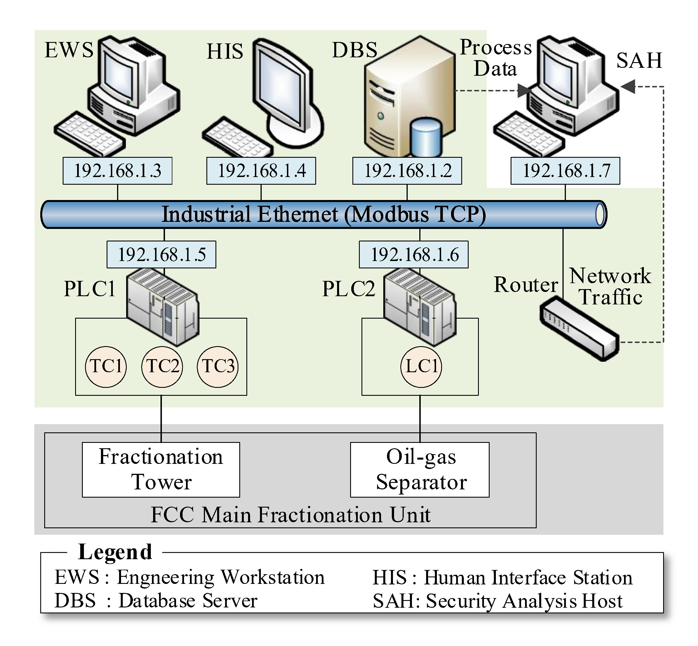
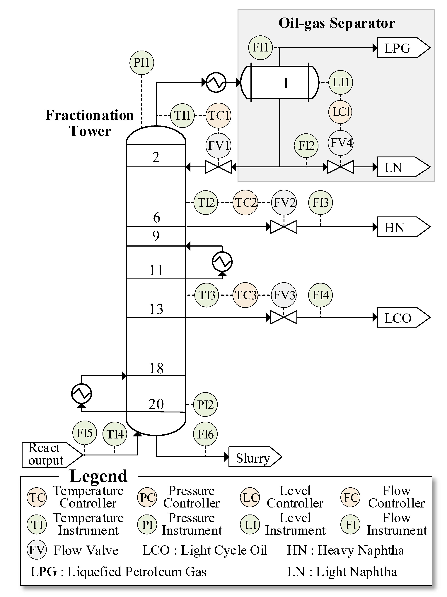
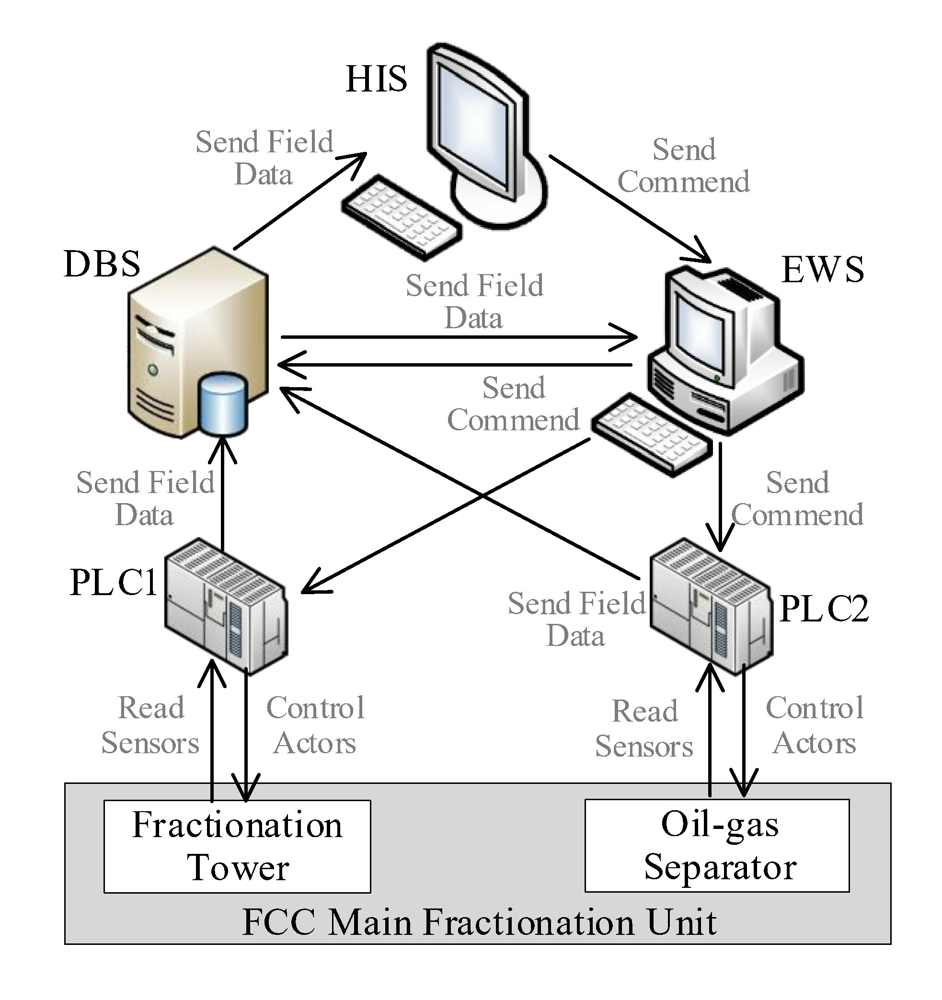

<!--
 * @Author: Xin Du
 * @Date: 2024-12-16 10:50:30
 * @LastEditors: Xin Du
 * @LastEditTime: 2024-12-19 16:31:39
 * @Description: file content
-->


# MAAI Project

## 1. Project Introduction

This project has open sourced an industrial cyber physical system simulation environment for experimental datasets and detection programs used in attack detection. More specifically, it includes: 

* The simulation system for petroleum catalytic cracking fractionation (FCC) unit includes cyber domain communication and control behavior simulation, as well as physical domain fractionation unit process simulation.
  
* Based on the above simulation system, various network attacks and system failure behaviors were simulated to generate a dataset for attack detection.
 
* A proposed attack fault identification method was validated based on a dataset.

The following introduces the use of simulation code, simulation data, and detection code.

## 2. ICPS simulation system

### 2.1 Components of the ICPS Simulation System
- **Information Domain**: Simulate the communication behaviors based on Modbus TCP among multiple devices and the control behaviors of PLCs through [pymodbus](https://pymodbus.readthedocs.io/en/latest/).
- **Physical Domain**: Based on the open-source FCC fractionation unit simulation [FCC-Fractionator](https://github.com/Baldea-Group/FCC-Fractionator) in Matlab, extract the fractionation tower and oil-gas separator parts as the physical process. 





- The following figure shows the simulation data interaction relationship among different devices in the information domain. Periodic data interaction is carried out among the devices to simulate the device polling communication in the ICPS system.




### 2.2 仿真系统使用

- Information Domain Simulation Python Environment
  - **npcap**: npcap-1.80
  - **Python Package Versions**:
```
python==1.6.13
pymodbus==2.4.0
scapy==2.5.0
deepod==0.4.1
```

- Physical Domain Simulation Environment
  - **Matlab**: Matlab R2018A
  - **matlabengine for Python**

- Simulation Run Preparation
  - Set the simulation run start time and duration dictionary `mode_config` for each mode in `./cyber_domain_simulation.py`.
  - Set the simulation run state through `sim_state`.

- Simulation Program Running
  - Execute the program `python simulation_console.py`. 


## 3. Attack fault simulation dataset

### 3.1 Experimental Data from the Simulation System

The experimental dataset collected from the simulation system includes data of multiple abnormal modes, which comes from the simulation of multiple models and the final integration of the data. The `./data` folder contains sample simulation data.


### 3.2  Simulation Data in Specific Folders

The `./data/cyber` and `./data/physical` folders contain simulation data CSV files under various modes. The integrated simulation files are as follows:
- **Network Communication Messages**: `./data/Combined_cyber_data_1214_20.csv`
- **Process Data**: `./data/Combined_physical_data_1214_20.csv` 


## 4. Attack fault identification

### 4.1 Multi-domain Anomaly Device Detection

- Software Environment Requirements
```
python==3.8.5
tensorflow==2.7.0
torch==1.10.1+cu102
scikit-learn==1.3.2
pgmpy==0.1.25
```

- Program Parameter Configuration
  - Set the experimental data category `data_type` to either `cyber` or `physical` in the function `cyber_anomaly_detection()` of `./model/multidomain_anomaly_detector.py`.
  - Set the list of experimental models `test_model_list`.
  - The training parameters of the DL model are set in `./config/model_config.py`, and the test grid for the detection threshold can also be found in this configuration file.


- Program Startup
  - Run `python Anomaly_detector.py` to train the models and test the anomaly localization performance of the models under different parameters within the preset parameter grid.
  - Observe the test results of different models in `./exp_files/record`.
  - Combine the test time of the target anomaly localization model, select the prediction results of the anomaly localization model saved in the folders `./exp_files/prediction/cyber` and `./exp_files/prediction/physical`, and record the paths for the next step of attack identification.


### 4.2 Distinguish between attacks and faults

- Observation of Evaluation Results for Typical Anomaly Events
  - Run `python attack_indentifier_test.py` to observe the attack intention evaluation results of the attack identifier on typical attack and failure events.
  - It also provides the attack risk and non-fault similarity of typical events.

- Attack Identification for Multi-domain Anomaly Detection
  - After running `python Anomaly_detector.py`, the attack identification results combined with multi-domain anomaly alarms will be printed in the command prompt (cmd). 
